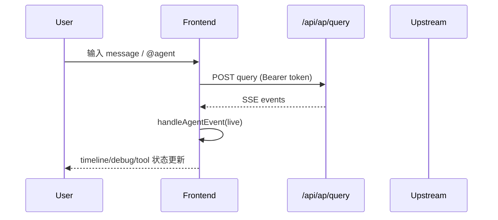
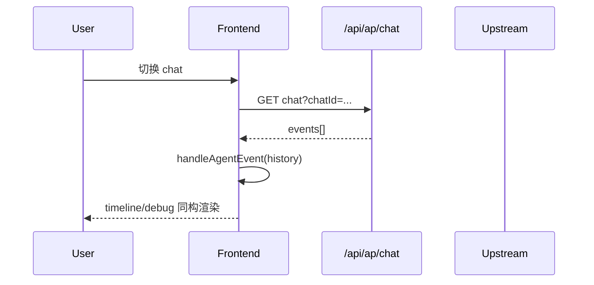
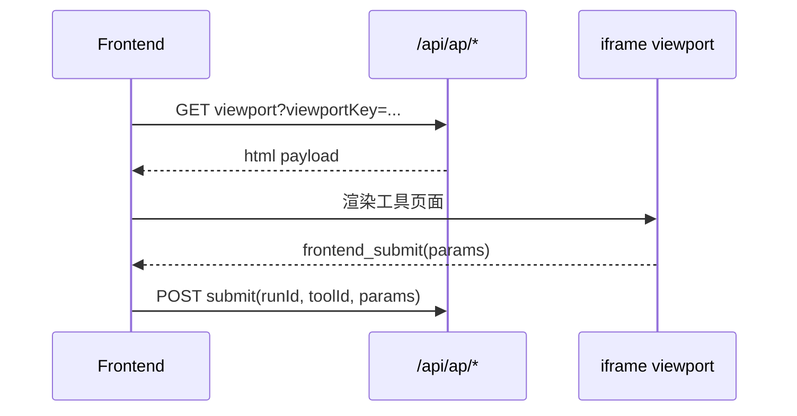

# 核心数据流

## 1. 主链路：实时查询（`POST /api/ap/query`）

关键事实：
- 事件顺序由上游驱动，前端按事件类型推进状态机。
- `run.complete|run.error|run.cancel` 是 run 终止边界。

## 2. 回放链路：历史会话（`GET /api/ap/chat`）

关键事实：
- history 与 live 走同一 `handleAgentEvent` 行为约束。
- 仅数据来源不同：实时流 vs 历史数组。

## 3. 前端工具链路（viewport + submit）

关键事实：
- 仅当前端工具类型满足条件时渲染 iframe。
- `submit` 依赖 `runId + toolId + params` 完整性。

## 4. 失败处理边界
1. HTTP 非 2xx -> `ApiError`。
2. JSON 非法或非响应壳 -> `ApiError`。
3. `code != 0` -> `ApiError` 并进入 UI/debug 错误态。
4. SSE 解析失败 -> 记录 debug，终止当前流。

## 5. 前端边界声明
1. 数据流文档仅描述“前端如何消费上游 API/SSE”，不推断后端内部处理步骤。
2. 若上游行为与当前文档不一致，先记录 `[DOC-GAP]`，再决定“改文档 / 改实现”。
