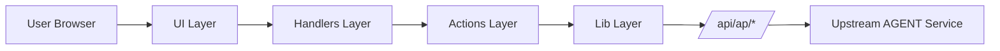

# 系统架构

## 1. 架构模式
- 形态：`frontend-monolith`（单前端仓库，消费外部 AGENT API）
- 通信：`HTTP JSON + SSE(text/event-stream)`

## 2. 架构图（Mermaid）

## 3. 分层规则
- 入口与装配：`main.js`、`app/bootstrap.js`
- Context：`app/context/*`
- Actions：`app/actions/*`
- Handlers：`app/handlers/*`
- Runtime：`app/runtime/*`
- 协议与解析：`lib/*`

## 4. 依赖方向
- `bootstrap -> handlers/actions/runtime/lib`
- `handlers -> actions/runtime/state`
- `actions -> lib/services`
- `runtime -> state/elements`
- 禁止反向依赖：`lib` 不依赖 `app/runtime`

## 5. 关键约束
1. 同一事件在 `live` 与 `history` 必须保持一致消费语义。
2. `run.complete/error/cancel` 必须终止 streaming 并清理前端工具覆盖层。
3. `actionId` 必须幂等执行（一次 run 内同 id 只执行一次）。
4. 解析失败必须写入 debug，不可静默吞掉。

## 6. 依赖边界（frontend-only）
1. 本仓库不维护任何 backend 内部实现文档。
2. 仅维护前端可观测的 `/api/ap/*` 契约、事件消费语义和 UI 状态约束。
