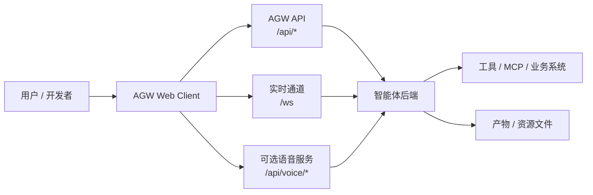

# AGW Web Client

AGW Web Client 是一套面向智能体平台的前端展示框架。它把智能体后端输出的对话流、推理过程、计划任务、工具调用、人工确认、文件产物和调试信息，组织成一个可以直接使用的 Web 工作台。

一句话说：后端负责“智能体怎么运行”，AGW Web Client 负责“智能体怎么被看见、被操作、被调试、被交付给用户”。

## 这个项目是什么

`agent-webclient` 是 AGW / AGENT 协议的 Web 客户端。它不是一个完整的智能体后端，也不负责定义模型、工具、调度、记忆或权限的最终语义；它是智能体平台的前端层，用来消费后端提供的 `/api/*`、`/ws`、`/api/voice/*` 等能力。

接入它以后，一个智能体后端可以很快拥有完整的产品化界面：

- 用户可以在统一工作台里和 Agent 或 Team 对话。
- 开发者可以实时查看事件流、工具执行、计划进度和错误状态。
- 平台可以把工具、表单、审批、文件预览、语音输入和历史回放接入同一套交互框架。

它适合用作智能体平台的默认前端、协议联调客户端、内部运行观察台，也适合嵌入 Desktop 宿主或部署到云端作为团队入口。

## 能做什么

### 智能体对话工作台

- 支持 Agent / Team 切换和会话导航。
- 支持流式对话输出，默认产品链路优先使用 WebSocket，也保留 SSE 兼容路径。
- 支持历史会话加载、运行中会话续接、回放、未读状态和归档。
- 支持附件上传、运行参数、模型覆盖、访问级别和运行中 steer / interrupt。

### 运行过程可观测

- 将后端事件归并为清晰的时间线节点。
- 展示 content、reasoning、planning、tool、source、usage、debug 等运行信息。
- 支持结构化计划面板，展示任务状态、进度和耗时。
- 支持右侧调试面板和 run transcript，方便排查协议和事件问题。

### 工具与业务视图容器

- 支持 Frontend Tool，以 iframe 方式加载工具交互页面。
- 支持 Viewport HTML 嵌入，用于在消息、工具或表单里呈现后端生成的业务视图。
- 支持工具结果提交、关闭、完成状态同步。
- 支持 Artifact 发布和资源预览，包括图片、PDF、HTML、文本、音频、视频、Office 等常见文件。

### 人在回路交互

- 支持 question、approval、form、plan 四类 HITL 场景。
- 可以在运行中向用户提问、请求审批、展示表单或发起计划确认。
- 支持提交去重、超时处理、远端回答同步和敏感回答脱敏回显。

### 管理与扩展入口

- 提供 Agent 管理台，用于查看、创建、编辑、排序和诊断 agent 定义。
- 提供 Registry 管理台，用于查看 provider、model、MCP server、viewport server 和 tools 目录。
- 支持可选语音能力，包括浏览器音频采集、ASR WebSocket 和 TTS 播放。
- 支持 ZenMind Desktop WebView 桥接，包括路由上报、截图、文件系统选择和 query context 注入。

## 能带来什么好处

### 对平台团队

不用从零搭智能体前端。对话、时间线、计划、工具、审批、资源预览、管理台和部署方式都已经组织好，平台团队可以把主要精力放在智能体后端、工具生态和业务能力建设上。

### 对后端和协议团队

前端按事件流消费 AGW / AGENT 协议，运行过程可以实时看见，也可以从历史会话回放。新增事件、工具或运行状态时，联调成本更低，问题定位更直接。

### 对业务团队

智能体不只是一个聊天框。它可以展示计划、调用工具、请求审批、生成文件、嵌入业务页面，并让用户在同一个界面里完成确认、补充和接管。

### 对部署和交付团队

项目支持本地开发、Docker Compose 一键启动、离线镜像包、Desktop Program Bundle 等多种交付方式。只要上游 AGW API 可访问，就可以快速把同一套前端部署到本地、内网服务器、云主机或 Desktop 宿主里。

## 工作方式



前端只消费后端协议和资源，不替后端决定智能体如何规划、如何调用工具、如何鉴权或如何存储数据。后端仍是事实源，Web Client 负责把事实源展示成可用的产品界面。

## 快速开始

### 前置要求

- Node.js 18+
- npm 9+
- GNU Make
- 可访问的 AGW / AGENT API 服务
- Docker Desktop 或 Docker Engine + Compose v2，仅容器部署和镜像发布需要

### 1. 初始化配置

```bash
cp .env.example .env
```

至少确认 `.env` 中的这些字段：

```bash
PORT=11948
BASE_URL=http://localhost:11949
# VOICE_BASE_URL=http://localhost:11953
```

字段说明：

- `PORT`：本地开发端口，也是 Docker Compose 暴露到宿主机的端口。
- `BASE_URL`：AGW / AGENT 后端地址，前端会把 `/api/*` 和 `/ws` 代理到这里。
- `VOICE_BASE_URL`：可选语音服务地址。未设置时语音入口会隐藏。

### 2. 安装依赖

```bash
make install
```

等价命令：

```bash
npm install
```

### 3. 本地启动

```bash
make dev
```

打开 [http://localhost:11948](http://localhost:11948)。

开发模式下，Webpack Dev Server 会代理：

- `/api/*` 到 `BASE_URL`
- `/ws` 到 `BASE_URL`
- `/api/voice/*` 和 `/api/voice/ws` 到 `VOICE_BASE_URL`，仅在配置语音服务时启用

### 4. 测试和构建

```bash
make test
make build
```

构建产物输出到 `dist/`。

## 一键容器部署

适合本机、内网服务器或云主机快速部署。

```bash
cp .env.example .env
# 修改 .env 中的 BASE_URL，必要时修改 PORT 和 VOICE_BASE_URL
make docker-up
```

默认访问地址：

```text
http://localhost:11948
```

查看容器状态：

```bash
docker compose -f compose.yml ps
```

查看日志：

```bash
docker compose -f compose.yml logs -f webclient
```

停止服务：

```bash
make docker-down
```

容器内使用 Nginx 托管静态资源，并将 `/api/*`、`/ws` 和可选语音接口反向代理到上游服务。Nginx 已对流式接口关闭代理缓冲，避免 SSE 或 WebSocket 事件被延迟。

## 云端部署

### 方式一：云主机源码部署

在云服务器上安装 Docker 和 Compose 后执行：

```bash
git clone <your-repo-url> agent-webclient
cd agent-webclient
cp .env.example .env
```

修改 `.env`：

```bash
PORT=11948
BASE_URL=https://your-agent-api.example.com
# VOICE_BASE_URL=https://your-voice-api.example.com
```

启动：

```bash
make docker-up
```

如果需要通过公网访问，请在云厂商安全组、防火墙和域名反向代理中开放对应端口或域名。

### 方式二：发布离线镜像包

在构建机生成镜像部署包：

```bash
make release-image
```

也可以指定架构：

```bash
ARCH=amd64 make release-image
ARCH=arm64 make release-image
```

产物路径：

```text
dist/release/agent-webclient-image-vX.Y.Z-linux-<arch>.tar.gz
```

将压缩包上传到目标服务器后：

```bash
tar -xzf agent-webclient-image-vX.Y.Z-linux-amd64.tar.gz
cd agent-webclient
cp .env.example .env
# 修改 .env 中的 BASE_URL、HOST_PORT、VOICE_BASE_URL
./start.sh
```

停止：

```bash
./stop.sh
```

这种方式适合不能在服务器上联网构建镜像的环境。

### 方式三：静态资源接入已有网关

也可以执行：

```bash
make build
```

然后将 `dist/` 部署到已有静态资源服务。但这种方式必须自行配置网关代理：

- `/api/*` 反向代理到 `BASE_URL`
- `/ws` 反向代理到 `BASE_URL` 并保留 WebSocket upgrade
- `/api/voice/*` 和 `/api/voice/ws` 按需代理到 `VOICE_BASE_URL`
- 对 SSE / WebSocket / 长连接关闭代理缓冲
- SPA fallback 到 `index.html`

如果没有现成网关配置，优先使用 Docker Compose 部署。

## Desktop Program Bundle

项目也支持打包为 ZenMind Desktop 托管的 Program Bundle：

```bash
make release
```

等价命令：

```bash
make release-program
```

默认生成 macOS arm64 和 Windows amd64 两个平台产物：

```text
dist/release/agent-webclient-vX.Y.Z-darwin-arm64.tar.gz
dist/release/agent-webclient-vX.Y.Z-windows-amd64.zip
```

Program Bundle 包含：

- `manifest.json`
- `.env.example`
- `frontend/dist/`
- Desktop 启停脚本

Program Bundle 不内置后端服务，HTTP 托管、静态资源服务和代理路由由 ZenMind Desktop main process 负责。

## 常用命令

| 命令 | 作用 |
| --- | --- |
| `make install` | 安装前端依赖 |
| `make dev` | 启动本地开发服务 |
| `make test` | 运行 Jest 测试 |
| `make build` | 构建生产静态资源 |
| `make docker-build` | 构建 Docker 镜像 |
| `make docker-up` | Docker Compose 构建并后台启动 |
| `make docker-down` | 停止 Docker Compose 服务 |
| `make release` | 生成 Desktop Program Bundle |
| `make release-image` | 生成离线 Docker 镜像部署包 |

## 配置说明

环境变量契约以 [`.env.example`](./.env.example) 为准。

| 变量 | 必填 | 说明 |
| --- | --- | --- |
| `PORT` | 是 | 本地开发端口，Docker Compose 中也是宿主机暴露端口 |
| `BASE_URL` | 是 | AGW / AGENT 后端 HTTP API 与主 `/ws` 基地址 |
| `VOICE_BASE_URL` | 否 | 语音 HTTP / WebSocket 服务地址，未设置时关闭语音入口 |
| `DESKTOP_APP` | 否 | Desktop 场景标记 |
| `DEBUG_PANEL_ENABLED` | 否 | 是否显示调试面板入口 |
| `SETTINGS_MENU_ENABLED` | 否 | 是否显示设置入口 |
| `MEMORY_ENABLED` | 否 | 是否显示 memory 相关入口 |

开发、容器部署和 release 构建复用同一组变量名。`.env` 是本地真实配置，不提交版本库。

## 上游服务要求

AGW Web Client 需要一个可访问的上游智能体服务。常用入口包括：

- `GET /api/agents`
- `GET /api/teams`
- `GET /api/chats`
- `GET /api/chat`
- `POST /api/query`
- `GET /api/attach`
- `POST /api/submit`
- `POST /api/interrupt`
- `POST /api/steer`
- `GET /api/viewport`
- `GET /api/resource`
- `GET /ws`
- `GET /api/voice/ws`，可选

前端统一按 `ApiResponse` 结构读取数据，并把错误包装为可展示的前端错误态。具体协议语义以后端 AGW / AGENT 服务为事实源。

## 项目结构

```text
public/                 HTML 模板等静态入口资源
docs/                   中文专题设计文档
src/app/                应用壳层、路由、布局、状态与页面入口
src/features/           对话、时间线、工具、计划、语音、worker 等功能模块
src/shared/data/        API 端点注册、请求客户端、鉴权和轻量缓存
src/shared/styles/      全局主题变量和样式入口
src/shared/ui/          通用基础 UI 组件
src/shared/utils/       通用工具函数
scripts/                发布、镜像和程序包辅助脚本
nginx.conf              容器内 Nginx 反向代理模板
compose.yml             Docker Compose 部署入口
```

## 深入文档

项目细节拆分在 [docs/](./docs/) 下。建议按下面顺序阅读：

- [应用入口路由与布局壳层](docs/应用入口路由与布局壳层.md)
- [事件数据结构与协议枚举](docs/事件数据结构与协议枚举.md)
- [API端点注册与DTO](docs/API端点注册与DTO.md)
- [流式传输SSE与WebSocket](docs/流式传输SSE与WebSocket.md)
- [时间线事件处理与渲染](docs/时间线事件处理与渲染.md)
- [Reasoning与Planning节点](docs/Reasoning与Planning节点.md)
- [计划事件与任务视图](docs/计划事件与任务视图.md)
- [FrontendTool容器协议](docs/FrontendTool容器协议.md)
- [Viewport视图容器](docs/Viewport视图容器.md)
- [HITL-Awaiting协议与状态机](docs/HITL-Awaiting协议与状态机.md)
- [Artifact发布与资源预览](docs/Artifact发布与资源预览.md)
- [AgentTeam选择与Worker列表](docs/AgentTeam选择与Worker列表.md)
- [Agent管理台](docs/Agent管理台.md)
- [Registry管理台与工具目录](docs/Registry管理台与工具目录.md)
- [语音输入ASR与TTS](docs/语音输入ASR与TTS.md)
- [Desktop宿主桥接](docs/Desktop宿主桥接.md)
- [版本化打包与部署](docs/版本化打包与部署.md)

## 常见问题

### 页面能打开，但接口请求失败

检查 `.env` 中的 `BASE_URL` 是否能被当前运行环境访问。容器部署时，`BASE_URL=http://localhost:xxxx` 指的是容器内部的 localhost，通常需要改成可从容器访问的地址，例如宿主机地址、内网域名或 `host.docker.internal`。

### WebSocket 无法连接

确认上游服务实际提供 `/ws`，并确认反向代理保留了 `Upgrade` 和 `Connection` 头。容器内置 Nginx 已处理这部分，使用自定义网关时需要自行配置。

### 实时输出变慢或一次性刷出

通常是代理缓冲未关闭。需要对 `/api/*`、`/ws` 和语音长连接关闭 buffering，并提高 read timeout。

### 语音入口没有出现

检查是否设置了 `VOICE_BASE_URL`。未设置时前端会隐藏语音能力。

### 本地启动端口冲突

修改 `.env` 中的 `PORT` 后重新执行：

```bash
make dev
```

## 边界说明

- 本仓库只提供 Web 客户端，不包含智能体后端。
- 前端不定义后端协议的最终语义，只消费和展示后端事件。
- 模型、工具、权限、记忆、任务调度和资源存储以后端服务为事实源。
- 脱离可访问的 AGW / AGENT API 服务，无法完成核心联调。
