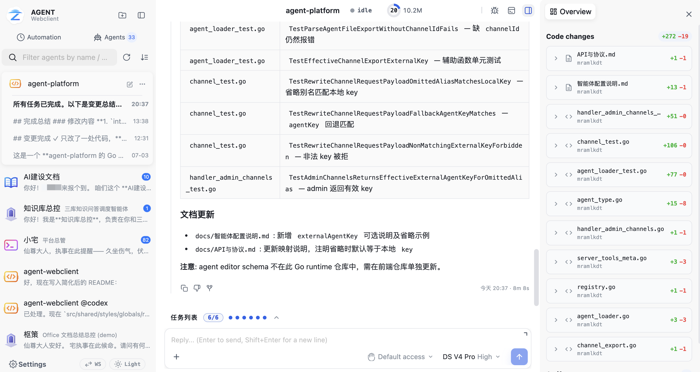
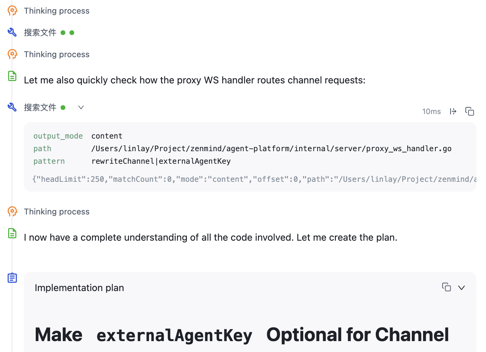
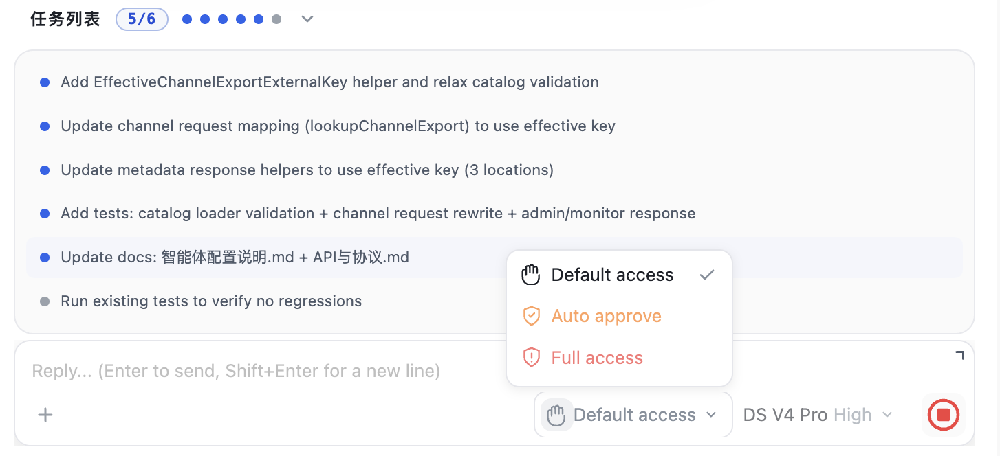
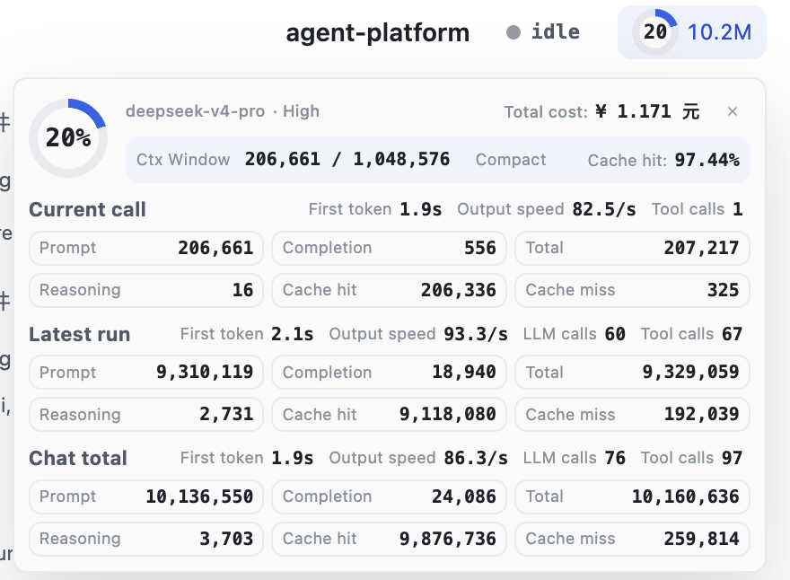
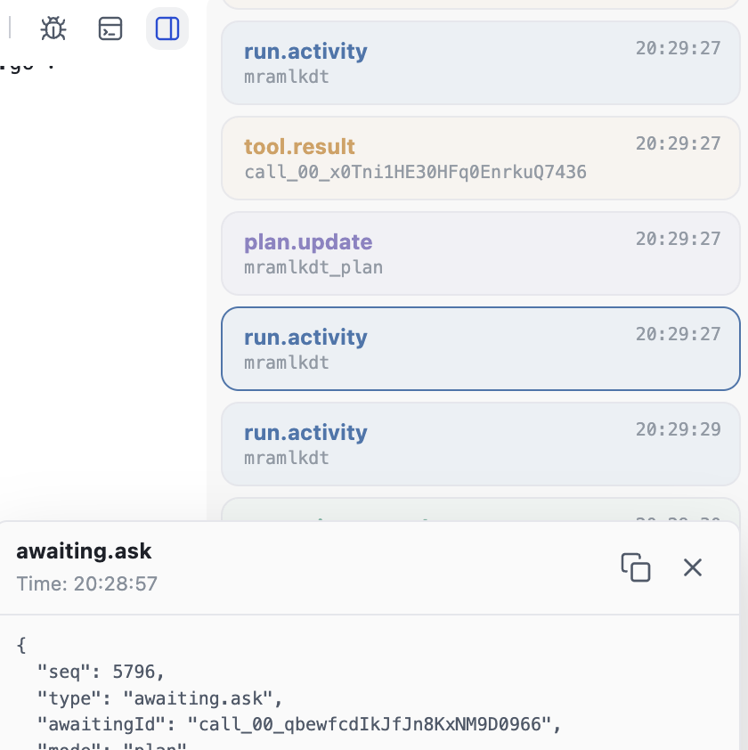
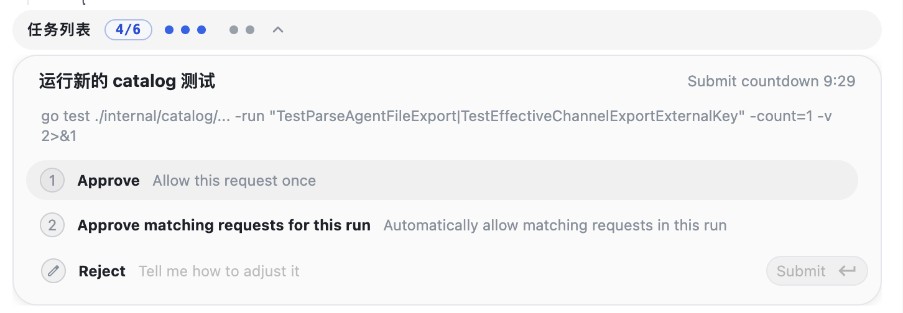
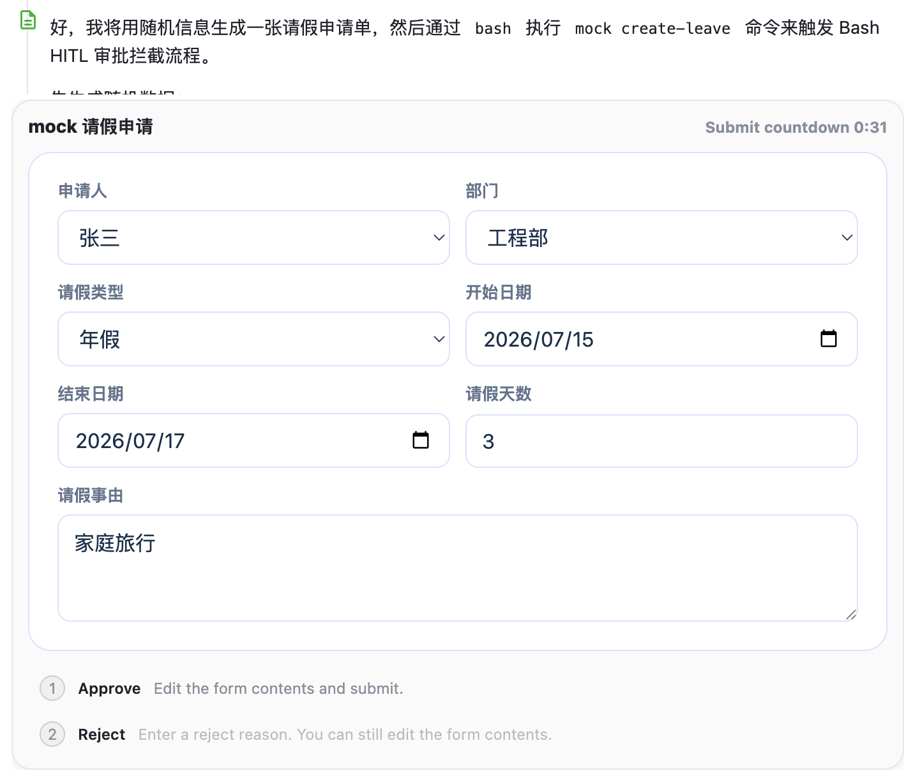
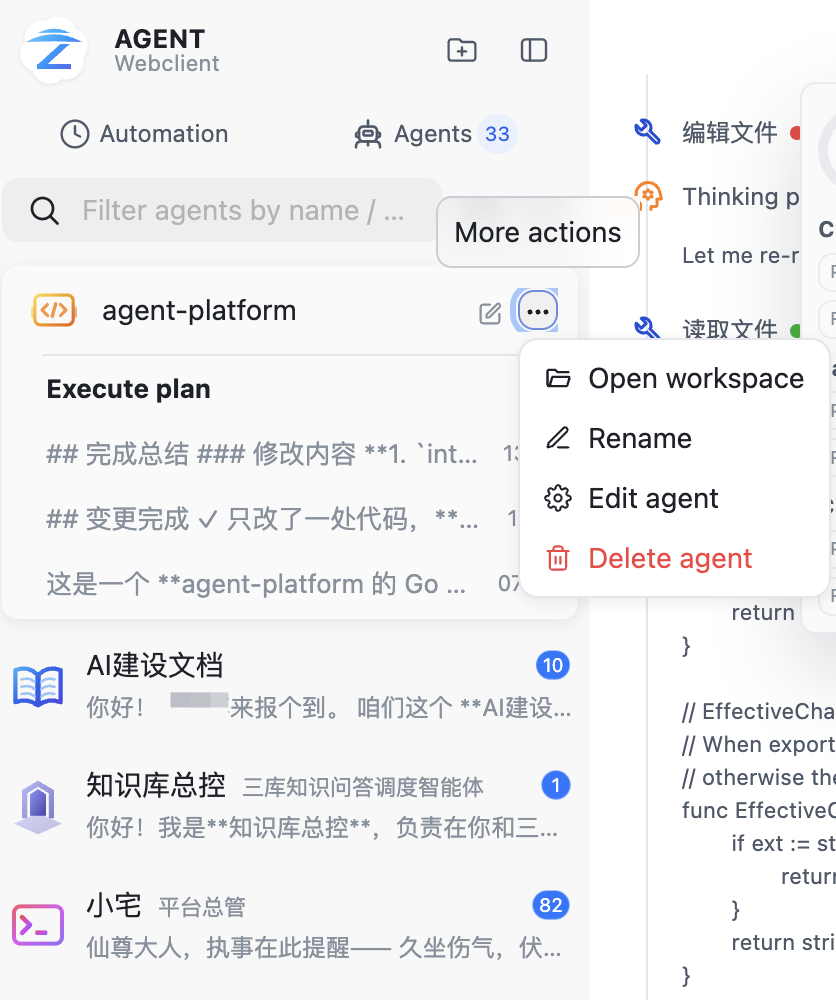
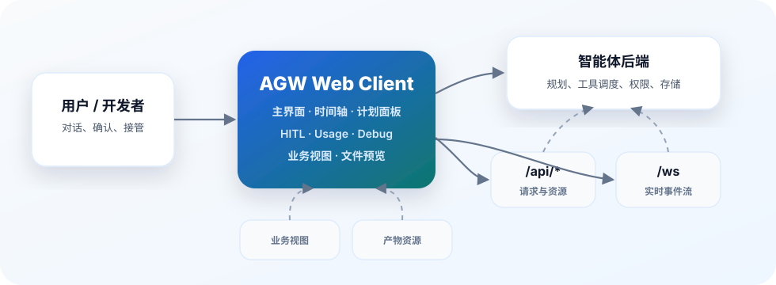

# AGW Web Client

AGW Web Client 是面向智能体平台的前端展示框架。它把智能体后端输出的对话、事件流、计划、工具调用、人工确认、产物和用量数据，整理成一个可直接使用的 Web 工作台。

后端负责智能体如何运行；AGW Web Client 负责把运行过程展示清楚，并提供操作、调试和交付界面。

## 这个项目是什么

`agent-webclient` 是 AGW / AGENT 协议的 Web 客户端。它不包含智能体后端，也不定义模型、工具、调度、记忆或权限的最终语义；它消费上游 `/api/*` 与 `/ws` 能力，为智能体平台提供统一前端。

接入以后，一个智能体后端可以快速拥有：

- 面向用户的对话主界面。
- 面向研发的事件时间轴、计划面板和 debug 侧边栏。
- 面向运营的 usage 统计和 budget 配置入口。
- 面向业务的 HITL、表单、审批、业务视图和文件预览能力。

## 能做什么

### 智能体对话工作台

主界面围绕“选 Agent、发消息、看执行、接管运行”组织。顶部按钮提供新会话、用量统计、debug 面板和运行状态入口；左侧用于 Agent 与会话导航；中间展示时间轴；底部 Composer 提供发送、附件、运行参数、模型覆盖、访问级别、steer 和 interrupt 等操作。



### 运行过程可观测

运行中的每个事件都会进入时间轴：消息内容、推理、规划、工具调用、来源、产物、等待用户输入和错误状态都能按顺序展示。结构化计划会进入计划面板，展示任务状态、进度、耗时和任务关联的运行内容。





### Usage 与预算管理

前端支持 `usage.snapshot`，可以展示当前调用、最新 run、会话累计和上下文压缩相关用量，包括输入 / 输出 / 推理 token、总 token、缓存命中、LLM 调用数、工具调用数、上下文窗口、首字延迟、输出速度和预计费用。Agent 管理台支持维护 `budget` JSON，把 token、步骤、工具调用等预算约束交给后端执行。



### Debug 联调侧边栏

右侧 debug 侧边栏可以按 run、request、content、reasoning、planning、plan、task、tool、awaiting、artifact、source、memory 等类型筛选事件，并查看原始事件、前端归并状态和可读 transcript。它是协议联调、现场排障和演示解释时最有用的面板之一。



### 人在回路交互

支持 question、approval、form、plan 四类 HITL 场景。智能体运行到关键节点时，可以向用户提问、请求审批、展示表单或发起计划确认；用户提交后，结果会回到运行流并在时间轴中回显。



### 业务视图容器

支持 Viewport HTML 和 Frontend Tool iframe 容器。后端可以把业务页面、工具界面或表单视图交给前端展示，前端负责加载、初始化、通信、提交和关闭。Artifact 面板支持图片、PDF、HTML、文本、音频、视频、Office 等文件预览。



### 侧边栏与管理入口

左侧侧边栏聚合 Agent、Team、会话、pending awaiting、active run 和未读状态。管理页提供 Agent 定义查看、创建、编辑、排序和诊断；Registry 页面管理 provider、model、viewport server 与非 MCP tools，MCP 连接器及所属工具由独立页面管理。



## 能带来什么好处

- **更快搭平台**：不用从零做智能体前端，对话、时间轴、计划、HITL、业务视图、用量统计和部署方式都已就绪。
- **更容易联调**：事件流、debug 侧边栏和历史回放让协议问题、工具问题、状态问题更容易定位。
- **更适合交付**：用户看到的不只是聊天框，而是一个能看计划、批操作、填表单、预览产物、接管运行的工作台。
- **更方便控成本**：usage 让消耗可见，budget 让限制进入 Agent 定义，便于团队治理和运营复盘。

## 工作方式



前端只消费后端协议和资源，不替后端决定智能体如何规划、如何调用工具、如何鉴权或如何存储数据。后端仍是事实源，Web Client 负责把事实源展示成可用的产品界面。

## 快速开始

### 前置要求

- Node.js 18+
- npm 9+
- GNU Make
- 可访问的 AGW / AGENT API 服务
- Docker Desktop 或 Docker Engine + Compose v2，仅容器部署和镜像发布需要

### 1. 初始化配置

```bash
cp .env.example .env
```

至少确认：

```bash
BASE_URL=http://localhost:11949
BACKEND_MODE=platform
```

- `PORT`：可选。本地开发端口和 Docker Compose 暴露到宿主机的端口，未设置时默认使用 `11948`；也可由 CLI args、环境变量或宿主配置注入。
- `BASE_URL`：AGW / AGENT 后端地址，前端会把 `/api/*` 和 `/ws` 代理到这里。
- `BACKEND_MODE`：默认 `platform`，保留 Bearer Token；设置为 `gateway` 时使用同源 Session Cookie，并在最终 401 后进入 Gateway 配置的登录流程。

### 2. 安装依赖并启动

```bash
make install
make dev
```

打开 [http://localhost:11948](http://localhost:11948)。

开发模式下，Webpack Dev Server 会代理：

- `/api/*` 到 `BASE_URL`
- `/ws` 到 `BASE_URL`
- `/auth/*` 到 `BASE_URL`，供 Gateway OIDC/SSO 使用

### 3. 测试和构建

```bash
make test
make build
```

构建产物输出到 `dist/`。

## 一键容器部署

适合本机、内网服务器或云主机快速部署。

```bash
cp .env.example .env
# 修改 .env 中的 BASE_URL，必要时修改 PORT
make docker-up
```

默认访问地址：

```text
http://localhost:11948
```

查看状态和日志：

```bash
docker compose -f compose.yml ps
docker compose -f compose.yml logs -f webclient
```

停止服务：

```bash
make docker-down
```

容器内使用 Nginx 托管静态资源，并将 `/api/*` 和 `/ws` 反向代理到上游服务。Nginx 已对流式接口关闭代理缓冲，避免实时事件被延迟。

## 云端部署

### 方式一：云主机源码部署

在云服务器上安装 Docker 和 Compose 后执行：

```bash
git clone <your-repo-url> agent-webclient
cd agent-webclient
cp .env.example .env
```

修改 `.env`：

```bash
PORT=11948
BASE_URL=https://your-agent-api.example.com
```

启动：

```bash
make docker-up
```

如果需要公网访问，请在安全组、防火墙和域名网关中开放对应端口或域名。

### 方式二：发布离线镜像包

在构建机生成镜像部署包：

```bash
make release-image
```

也可以指定架构：

```bash
ARCH=amd64 make release-image
ARCH=arm64 make release-image
```

产物路径：

```text
dist/release/agent-webclient-image-vX.Y.Z-linux-<arch>.tar.gz
```

将压缩包上传到目标服务器后：

```bash
tar -xzf agent-webclient-image-vX.Y.Z-linux-amd64.tar.gz
cd agent-webclient
cp .env.example .env
# 修改 .env 中的 BASE_URL 和 HOST_PORT
./start.sh
```

停止：

```bash
./stop.sh
```

这种方式适合不能在服务器上联网构建镜像的环境。

### 方式三：静态资源接入已有网关

也可以执行：

```bash
make build
```

然后将 `dist/` 部署到已有静态资源服务，并自行配置：

- `/api/*` 反向代理到 `BASE_URL`
- `/ws` 反向代理到 `BASE_URL` 并保留 WebSocket upgrade
- 对流式接口关闭代理缓冲
- SPA fallback 到 `index.html`

没有现成网关配置时，优先使用 Docker Compose。

## Desktop Program Bundle

项目支持打包为 Desktop 托管的 Program Bundle：

```bash
make release
```

等价命令：

```bash
make release-program
```

默认生成：

```text
dist/release/agent-webclient-vX.Y.Z-darwin-arm64.tar.gz
dist/release/agent-webclient-vX.Y.Z-windows-amd64.zip
```

Program Bundle 包含 `manifest.json`、`.env.example`、`frontend/dist/` 和 Desktop 启停脚本。它不内置后端服务，HTTP 托管、静态资源服务和代理路由由 Desktop main process 负责。Desktop Program Bundle 中的 `PORT`、`DESKTOP_APP` 和普通 `/api`、`/ws` 的 `BASE_URL` 由 Desktop 在 host-managed start 阶段提供，不写入 bundle `.env`。

## 配置说明

环境变量契约以 [`.env.example`](./.env.example) 为准。

| 变量 | 必填 | 说明 |
| --- | --- | --- |
| `PORT` | 否 | 本地开发端口，Docker Compose 中也是宿主机暴露端口；未设置时默认 `11948`，也可由 CLI args、环境变量或宿主配置注入 |
| `BASE_URL` | 是 | AGW / AGENT 后端 HTTP API 与主 `/ws` 基地址 |
| `BACKEND_MODE` | 否 | `platform`（默认）保留 Token 认证；`gateway` 使用 Session Cookie、CSRF 与登录回跳 |
| `DEBUG_PANEL_ENABLED` | 否 | 是否显示调试面板入口 |
| `SETTINGS_MENU_ENABLED` | 否 | 是否显示设置入口 |
| `MEMORY_ENABLED` | 否 | 是否显示 memory 相关入口 |

开发、容器部署和 release 构建复用同一组变量名。`.env` 是本地真实配置，不提交版本库。

## 上游服务要求

AGW Web Client 需要一个可访问的上游智能体服务。常用入口包括：

- `GET /api/agents?includeTeam=true`：返回按最近 `lastRunId` 混排的 Agent / Team 扁平列表；Team 带 `kind: "team"`、会话统计与最近 chats。HTTP 与 WebSocket `/api/agents` 使用相同字段。
- `GET /api/chats`：可带 `agentKey`、`mode`；`mode` 只影响 Agent-owned chat，必须保留 Team-owned chat。
- `GET /api/chat`
- `POST /api/query`
- `GET /api/attach`
- `POST /api/submit`
- `POST /api/interrupt`
- `POST /api/steer`
- `GET /api/viewport`
- `GET /api/resource`
- `GET /ws`

前端统一按 `ApiResponse` 结构读取数据，并把错误包装为可展示的前端错误态。具体协议语义以后端 AGW / AGENT 服务为事实源。

## 项目结构

```text
public/                 HTML 模板等静态入口资源
docs/                   中文专题设计文档和截图资源，专题按模块编号
src/app/                应用壳层、路由、布局、状态与页面入口
src/features/           对话、时间线、工具、计划、worker 等功能模块
src/shared/data/        API 端点注册、请求客户端、鉴权和轻量缓存
src/shared/styles/      全局主题变量和样式入口
src/shared/ui/          通用基础 UI 组件
src/shared/utils/       通用工具函数
scripts/                发布、镜像和程序包辅助脚本
nginx.conf              容器内 Nginx 反向代理模板
compose.yml             Docker Compose 部署入口
```

## 深入文档

项目细节拆分在 [docs/](./docs/) 下。文档按两位编号分段，建议按模块阅读：

### 01 应用基础

- [01-应用基础-应用入口路由与布局壳层](docs/01-应用基础-应用入口路由与布局壳层.md)
- [02-应用基础-全局状态与Reducer](docs/02-应用基础-全局状态与Reducer.md)
- [03-应用基础-运行时配置与功能开关](docs/03-应用基础-运行时配置与功能开关.md)

### 10 协议数据

- [10-协议数据-事件数据结构与协议枚举](docs/10-协议数据-事件数据结构与协议枚举.md)
- [11-协议数据-API端点注册与DTO](docs/11-协议数据-API端点注册与DTO.md)
- [12-协议数据-请求路由缓存与鉴权错误](docs/12-协议数据-请求路由缓存与鉴权错误.md)
- [13-协议数据-流式传输SSE与WebSocket](docs/13-协议数据-流式传输SSE与WebSocket.md)

### 20 会话输入

- [20-会话输入-会话加载回放与LiveSummary](docs/20-会话输入-会话加载回放与LiveSummary.md)
- [21-会话输入-Composer输入与快捷交互](docs/21-会话输入-Composer输入与快捷交互.md)
- [22-会话输入-消息发送路由与运行控制](docs/22-会话输入-消息发送路由与运行控制.md)
- [23-会话输入-运行参数模型与访问级别](docs/23-会话输入-运行参数模型与访问级别.md)
- [24-会话输入-附件上传与引用](docs/24-会话输入-附件上传与引用.md)

### 30 运行时间线

- [30-运行时间线-时间线事件处理与渲染](docs/30-运行时间线-时间线事件处理与渲染.md)
- [31-运行时间线-Reasoning与Planning节点](docs/31-运行时间线-Reasoning与Planning节点.md)
- [32-运行时间线-计划事件与任务视图](docs/32-运行时间线-计划事件与任务视图.md)
- [33-运行时间线-Artifact发布与资源预览](docs/33-运行时间线-Artifact发布与资源预览.md)

### 40 交互容器

- [40-交互容器-Viewport视图容器](docs/40-交互容器-Viewport视图容器.md)
- [41-交互容器-FrontendTool容器协议](docs/41-交互容器-FrontendTool容器协议.md)
- [42-交互容器-HITL-Awaiting协议与状态机](docs/42-交互容器-HITL-Awaiting协议与状态机.md)
- [43-交互容器-HITL-Question问题交互](docs/43-交互容器-HITL-Question问题交互.md)
- [44-交互容器-HITL-Approval审批交互](docs/44-交互容器-HITL-Approval审批交互.md)
- [45-交互容器-HITL-Form表单HTML交互](docs/45-交互容器-HITL-Form表单HTML交互.md)
- [46-交互容器-HITL-Plan计划决策](docs/46-交互容器-HITL-Plan计划决策.md)

### 50 Worker管理

- [50-Worker管理-AgentTeam选择与Worker列表](docs/50-Worker管理-AgentTeam选择与Worker列表.md)
- [51-Worker管理-Agent管理台](docs/51-Worker管理-Agent管理台.md)
- [52-Worker管理-Registry管理台与工具目录](docs/52-Worker管理-Registry管理台与工具目录.md)

### 60 页面能力

- [60-页面能力-Memory页面](docs/60-页面能力-Memory页面.md)
- [61-页面能力-Archive归档页面](docs/61-页面能力-Archive归档页面.md)
- [62-页面能力-Automation页面](docs/62-页面能力-Automation页面.md)

### 70+ 周边能力与交付

- [70-语音能力-语音输入ASR与TTS](docs/70-语音能力-语音输入ASR与TTS.md)
- [80-界面基础-样式主题基础UI与国际化](docs/80-界面基础-样式主题基础UI与国际化.md)
- [81-宿主集成-Desktop宿主桥接](docs/81-宿主集成-Desktop宿主桥接.md)
- [90-交付运维-开发代理与生产反向代理](docs/90-交付运维-开发代理与生产反向代理.md)
- [91-交付运维-版本化打包与部署](docs/91-交付运维-版本化打包与部署.md)
- [92-质量验证-手工测试用例](docs/92-质量验证-手工测试用例.md)

## 常见问题

### 页面能打开，但接口请求失败

检查 `.env` 中的 `BASE_URL` 是否能被当前运行环境访问。容器部署时，`BASE_URL=http://localhost:xxxx` 指的是容器内部的 localhost，通常需要改成可从容器访问的宿主机地址、内网域名或 `host.docker.internal`。

### WebSocket 无法连接

确认上游服务实际提供 `/ws`，并确认反向代理保留了 `Upgrade` 和 `Connection` 头。容器内置 Nginx 已处理这部分，使用自定义网关时需要自行配置。

### 实时输出变慢或一次性刷出

通常是代理缓冲未关闭。需要对 `/api/*` 和 `/ws` 关闭 buffering，并提高 read timeout。

### 本地启动端口冲突

修改 `.env` 中的 `PORT` 后重新执行：

```bash
make dev
```

## 边界说明

- 本仓库只提供 Web 客户端，不包含智能体后端。
- 前端不定义后端协议的最终语义，只消费和展示后端事件。
- 模型、工具、权限、记忆、任务调度和资源存储以后端服务为事实源。
- 脱离可访问的 AGW / AGENT API 服务，无法完成核心联调。
